# System Architecture & Technical Specifications

## 1. Directory Structure
```
MULTIStream/
├── config/
│   └── vocab.yaml                # ~60 CCTV classes for YOLO-World
├── src/
│   ├── ingest/
│   │   ├── detect_track.py       # YOLO-World inference + ByteTrack tracking
│   │   ├── embed.py              # SigLIP image & text feature extractors
│   │   ├── start_time.py         # 4-stage start time resolution chain
│   │   └── pipeline.py           # Ingestion orchestrator
│   ├── index/
│   │   ├── db.py                 # SQLite WAL connection & query abstractions
│   │   └── schema.sql            # Table definitions & spatial/temporal indexes
│   ├── query/
│   │   ├── parser.py             # Query parser with LLM providers & rule fallback
│   │   ├── timeparse.py          # Relative & absolute timestamp parser
│   │   ├── search.py             # Vector similarity search, filtering & deduplication
│   │   └── clips.py              # ffmpeg on-demand clip extraction
│   ├── memory/
│   │   └── aliases.py            # Clarify-once persistent alias & polygon manager
│   ├── llm/
│   │   └── providers.py          # Pluggable Claude/Gemini/Rule-based interface
│   ├── api/
│   │   └── main.py               # FastAPI application endpoints
│   └── ui/
│       ├── index.html            # Static chat UI & video viewer
│       ├── app.js                # Frontend client logic & canvas drawing
│       └── style.css             # UI styling
├── scripts/
│   ├── check_env.py              # Environment & hardware diagnostics
│   ├── ingest.py                 # CLI batch ingest runner
│   ├── query.py                  # CLI query runner
│   ├── watch.py                  # Folder watcher for automated ingestion
│   ├── record.py                 # RTSP video stream recorder
│   └── eval.py                   # Benchmark evaluation harness
├── tests/                        # Automated unit and integration tests
├── eval/                         # Queries and ground truth evaluation data
│   ├── queries.json              # Human-supplied test queries
│   └── results/                  # Benchmark run artifacts
├── footage/                      # Dropped manual footage (git-ignored)
├── live_footage/                 # Ingested stream footage (git-ignored)
├── index_<embedder>/             # SQLite database and snapshot files (git-ignored)
├── REPORTS/                      # Phase milestone reports
├── PLAN.md, TASKS.md, RULES.md, EVAL.md, DECISIONS.md, README.md
└── requirements.txt, .env.example, .gitignore
```

## 2. Ingestion & Search Data Flow

```mermaid
flowchart TD
    subgraph Ingestion
        V[Video File] --> ST[Start Time Resolver]
        V --> FS[Frame Sampler: Stride 5]
        FS --> YW[YOLO-World Detector: vocab.yaml]
        YW --> BT[ByteTrack Tracker]
        BT --> BF[Best Frame Selector: Max Area x Conf]
        BF --> SN[Save Annotated Snapshot: JPEG ~640px]
        BF --> EMB_CROP[SigLIP Crop Embedding]
        FS --> EMB_FRAME[SigLIP Frame Embedding: 0.5 fps]
        EMB_CROP --> SQL[(SQLite Index: WAL Mode)]
        EMB_FRAME --> SQL
        ST --> SQL
    end

    subgraph Query
        Q[Natural Language Question] --> QP[Query Parser: LLM or Rules]
        QP -->|Extracts| OBJ[Object Description]
        QP -->|Extracts| LOC[Location Referent]
        QP -->|Extracts| TIME[Time Expression]
        LOC --> ALIAS{In Aliases or Camera List?}
        ALIAS -->|No| CLARIFY[Return Clarification Request]
        CLARIFY -->|User Selection| SAVE_A[Save to aliases table]
        ALIAS -->|Yes| SPATIAL[Camera / Polygon Filter]
        TIME --> TP[Time Parser relative to DB Latest]
        OBJ --> EMB_TXT[SigLIP Text Embedding]
        EMB_TXT --> VSEARCH[Cosine Search: Tracks & Frames]
        VSEARCH --> SPATIAL
        SPATIAL --> DEDUP[Temporal Near-Duplicate Merging]
        DEDUP --> OUT[Top Results: Camera + Timestamp + Snapshot]
        OUT --> FFMPEG[ffmpeg Clip Cutting on Demand]
        FFMPEG --> RES[Final Evidence Package]
    end
```



## 3. Database Schema
```sql
PRAGMA journal_mode=WAL;

CREATE TABLE IF NOT EXISTS config (
    key TEXT PRIMARY KEY,
    value TEXT NOT NULL
);

CREATE TABLE IF NOT EXISTS videos (
    path TEXT PRIMARY KEY,
    camera TEXT NOT NULL,
    start_time TEXT NOT NULL,       -- ISO-8601 string
    fps REAL NOT NULL,
    width INTEGER NOT NULL,
    height INTEGER NOT NULL,
    duration_s REAL NOT NULL,
    start_source TEXT NOT NULL,     -- manifest, filename, ffprobe, manual
    indexed_at TEXT NOT NULL
);

CREATE TABLE IF NOT EXISTS tracks (
    id TEXT PRIMARY KEY,
    video TEXT NOT NULL,
    camera TEXT NOT NULL,
    track_id INTEGER NOT NULL,
    label TEXT NOT NULL,
    t_start TEXT NOT NULL,          -- Absolute ISO-8601
    t_end TEXT NOT NULL,            -- Absolute ISO-8601
    t_best TEXT NOT NULL,           -- Absolute ISO-8601 of best frame
    offset_start REAL NOT NULL,     -- Seconds into video
    offset_end REAL NOT NULL,
    bbox_px TEXT NOT NULL,          -- JSON [x1, y1, x2, y2]
    bbox_norm TEXT NOT NULL,        -- JSON [x1, y1, x2, y2]
    snapshot TEXT NOT NULL,         -- Relative path to JPEG
    emb BLOB NOT NULL,              -- Float32 binary bytes
    FOREIGN KEY(video) REFERENCES videos(path)
);

CREATE TABLE IF NOT EXISTS frames (
    id TEXT PRIMARY KEY,
    video TEXT NOT NULL,
    camera TEXT NOT NULL,
    t_abs TEXT NOT NULL,
    offset_s REAL NOT NULL,
    snapshot TEXT NOT NULL,
    emb BLOB NOT NULL,
    FOREIGN KEY(video) REFERENCES videos(path)
);

CREATE TABLE IF NOT EXISTS aliases (
    name TEXT PRIMARY KEY,
    camera TEXT NOT NULL,
    polygon_norm TEXT,              -- JSON list of [x, y] normalized vertices or NULL
    created_at TEXT NOT NULL
);

CREATE INDEX IF NOT EXISTS idx_tracks_lookup ON tracks(camera, t_start, t_end);
CREATE INDEX IF NOT EXISTS idx_frames_lookup ON frames(camera, t_abs);
```

## 4. API Contract

### `POST /ask`
- Request body:
```json
{
  "query": "did a red car pass the main gate in the last hour?",
  "now_override": "2026-10-08T12:00:00",
  "session_id": "optional-uuid"
}
```
- Response (when resolved):
```json
{
  "status": "success",
  "results": [
    {
      "camera": "cam_gate",
      "timestamp": "2026-10-08T11:42:15",
      "offset_seconds": 125.4,
      "score": 0.842,
      "snapshot_url": "/snapshot/track_104",
      "clip_url": "/clip/track_104",
      "source": "track",
      "bbox_norm": [0.32, 0.41, 0.58, 0.69]
    }
  ]
}
```
- Response (when referent is unknown):
```json
{
  "status": "clarify",
  "referent": "main gate",
  "cameras": ["cam_gate", "cam_lobby", "cam_parking"]
}
```

### `POST /alias`
- Request body:
```json
{
  "name": "main gate",
  "camera": "cam_gate",
  "polygon_norm": [[0.1, 0.2], [0.9, 0.2], [0.9, 0.8], [0.1, 0.8]]
}
```
- Response: `{"status": "saved"}`

### `GET /cameras`
- Returns list of indexed cameras with time coverage and sample preview snapshots.

### `GET /snapshot/{id}`
- Returns annotated snapshot image file (`image/jpeg`).

### `GET /clip/{id}`
- Returns clipped MP4 video stream (`video/mp4`).

### `POST /upload`
- Multipart form upload of video file to `footage/` with optional metadata.

### `GET /health`
- Returns status, DB stats, device information, and active embedder.

## 5. Cloud Data Egress & Privacy Matrix
| Provider Mode | Data Sent Outside Machine | Purpose |
|---|---|---|
| `PARSER_PROVIDER=rules` | None (100% Local) | Rule-based regex/pattern parsing |
| `PARSER_PROVIDER=claude` | Query text, camera names list, known aliases | LLM JSON query understanding |
| `PARSER_PROVIDER=gemini` | Query text, camera names list, known aliases | LLM JSON query understanding |
| `RERANK_PROVIDER=off` | None (100% Local) | Local SigLIP vector rank only |
| `RERANK_PROVIDER=claude` | Top 10 snapshot images + query text | Multimodal VLM confirmation |
| `RERANK_PROVIDER=gemini` | Top 10 snapshot images + query text | Multimodal VLM confirmation |
